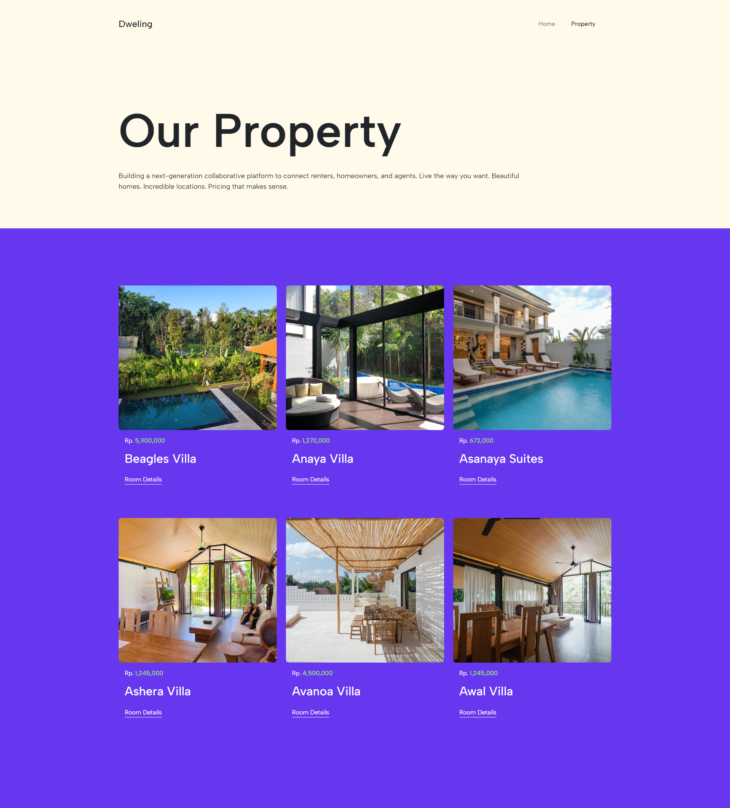
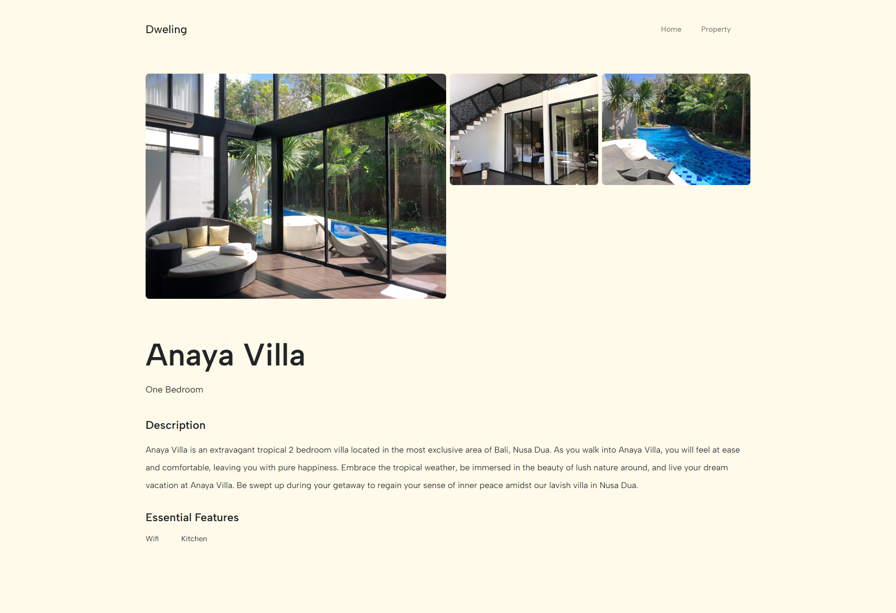
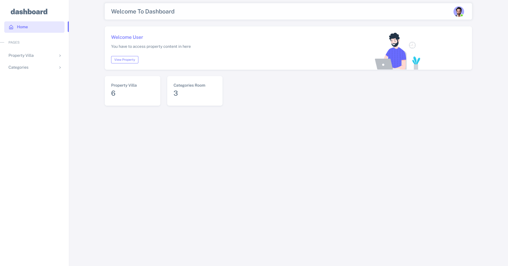
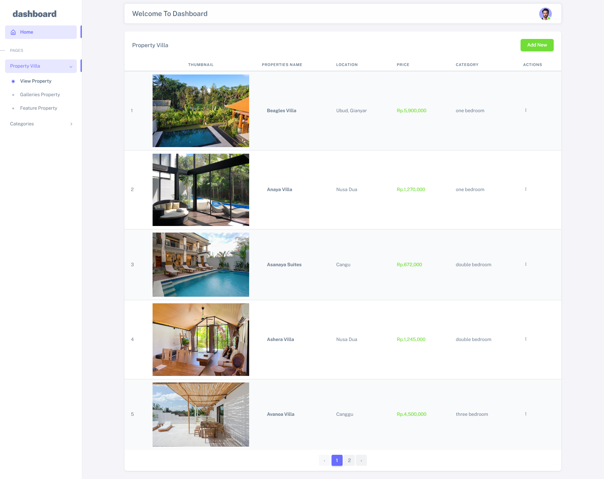

# Villa Project App

Merupakan aplikasi dashboard management mengelola villa berikut teknologi yang saya gunakan :

- [Laravel 8](https://laravel.com/docs/8.x)
- boostrap 5
- dashboard template by bootstrap 5
- Dropbox (Alternatif Penyimpanan Cloud)
  - link dokumentasi : [https://github.com/srmklive/flysystem-dropbox-v2](https://github.com/srmklive/flysystem-dropbox-v2)

<p align="center"><a href="https://laravel.com" target="_blank"></a></p>


# Halaman List


# Halaman Details



# Halaman Dashboard



# Setup

### Clone Repository

### Create Env with copy example
```
cp env.example .env
```

### Install Composer & npm
```
composer install
npm install
```

### Add Dropbox Token in .env to generate token check documentation link in above
```
DROPBOX_ACCESS_TOKEN=
```

# Migration
Create database in your server and run database migration
```
php artisan migrate
```

# Compile
You can add new module  app.js in `resources/app.js` and also to compile to use.
```
npm run dev
```

# Run Application
```
php artisan serve
```
